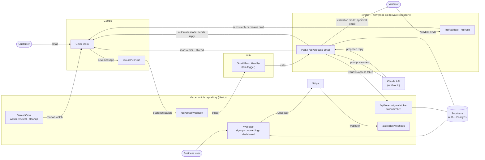

# FlowlyMail

**FlowlyMail connects to a company's Gmail inbox and uses Claude (Anthropic) to draft replies to incoming customer emails, which are either sent automatically or sent to a human validator for approval.**

This repository contains the web application (front end and server routes) deployed on Vercel. The email-processing API lives in a separate, **private** repository (`flowlymail-api`, deployed on Render).

> The user interface is in French.

---

## Features

**Accounts & onboarding**
- Invite-only access: sign up with email + password and an invite code, or with "Continue with Google" (Supabase Auth) followed by an invite code.
- Password reset by email.
- Onboarding form: company name, business information used as context by the AI, validator email address, and operating mode.
- Optional: generate the business description automatically from the company's website (content extracted with Firecrawl, summarized by Claude).
- Daily cleanup of Google accounts created without a valid invitation (after a 24-hour grace period).

**Gmail integration**
- Gmail connection through Google OAuth 2.0 with restricted scopes (`gmail.readonly`, `gmail.send`, `gmail.compose`, `gmail.modify`) instead of full mailbox access.
- Real-time processing with Gmail push notifications (Google Cloud Pub/Sub) instead of polling. Promotions, Social, Updates and Forums categories are excluded at the source.
- 20-second debounce on incoming notifications, because Gmail often sends several notifications for a single email.
- Daily renewal of Gmail watches, which Google expires after 7 days.
- Token broker endpoint that gives the processing pipeline a short-lived access token, and flags the account as revoked if the user withdrew access.

**Two operating modes**
- **Validation**: the proposed reply is emailed to the validator with *Validate* and *Edit* buttons. *Edit* opens the reply as a Gmail draft.
- **Automatic**: the reply is sent directly to the customer.

**Dashboard**
- Gmail connection status, with a reconnect prompt if access was revoked or expired.
- Company settings page (business information, validator email, mode).
- Subscription through Stripe Checkout; the subscription status is updated by a Stripe webhook.

**Operations**
- Discord alerts on unexpected server errors.
- Activity log table (`activity_logs`) for connections, token refreshes, onboarding and rate-limit counters.
- Terms of use and GDPR privacy policy pages.

**Processing API (private repository)**
- Obvious-spam filter, per-message lock against duplicate processing, per-sender rate limit.
- Thread history passed to Claude as context. Claude either writes a reply or marks the email as not requiring one (automated notifications, etc.).
- Guard against self-feeding loops (validator address = monitored address).
- Single-use tokens on the *Validate* / *Edit* links.

---

## Architecture



**Request flow**
1. A customer email reaches the connected Gmail inbox. Gmail notifies Google Cloud Pub/Sub, which pushes the notification to `/api/gmail/webhook` on Vercel.
2. The webhook checks its shared secret, debounces duplicate notifications and triggers an n8n workflow, which only forwards the call to the processing API.
3. The processing API (private repository, Render) gets a short-lived Gmail access token from the token broker, reads the email and its thread, filters it, and asks Claude for a reply.
4. Depending on the company's mode, the reply is sent directly, or an approval email with *Validate* / *Edit* links is sent to the validator.

Supabase provides authentication and the shared Postgres database, which the processing API reads through Prisma.

---

## Tech stack

| Area | Technologies |
|---|---|
| Web app (this repo) | Next.js 14 (App Router, Route Handlers, Middleware), React 18, TypeScript |
| Styling | Inline styles (Tailwind CSS is configured) |
| Auth & database | Supabase (Auth, Postgres, `@supabase/ssr`) |
| Email | Gmail API, Google OAuth 2.0, Google Cloud Pub/Sub |
| AI | Claude API (Anthropic Messages API), Firecrawl for website extraction |
| Payments | Stripe (Checkout, webhooks) |
| Hosting | Vercel (app + Cron) |
| Orchestration | n8n (thin trigger) |
| Processing API (private) | Node.js, Fastify, TypeScript, Prisma, Zod, Pino, Sentry, Vitest, GitHub Actions, Render |

---

## Screenshots

| Login | Onboarding |
|---|---|
|  |  |

| Dashboard | Settings |
|---|---|
|  |  |

| Validation email |
|---|
|  |

---

## Getting started

### Prerequisites
- Node.js 18.17 or later (required by Next.js 14)
- A Supabase project
- A Google Cloud project with the Gmail API enabled, an OAuth 2.0 client and a Pub/Sub topic
- Stripe, Anthropic and Firecrawl accounts for the related features

> The Supabase database schema (`entreprise`, `profiles`, `gmail_accounts`, `invite_codes`, `activity_logs`) is not included in this repository.
> Gmail push notifications require a public HTTPS URL for `/api/gmail/webhook`, so they cannot reach a plain `localhost` setup.

### Installation

```bash
git clone https://github.com/nasribafa-ctrl/flowlymail.git
cd flowlymail
npm install
cp .env.example .env.local   # then fill in your own values
npm run dev                  # http://localhost:3000
```

Other scripts: `npm run build`, `npm run start`, `npm run lint`.

### Environment variables

All variables are listed in [`.env.example`](.env.example).

| Variable | Purpose |
|---|---|
| `NEXT_PUBLIC_SUPABASE_URL` | Supabase project URL |
| `NEXT_PUBLIC_SUPABASE_ANON_KEY` | Supabase public (anon) key |
| `SUPABASE_SERVICE_ROLE_KEY` | Supabase service role key, **server-side only** |
| `GOOGLE_CLIENT_ID` | Google OAuth client ID |
| `GOOGLE_CLIENT_SECRET` | Google OAuth client secret |
| `GOOGLE_REDIRECT_URI` | OAuth redirect URI (`/api/gmail/callback`) |
| `GOOGLE_PUBSUB_TOPIC` | Pub/Sub topic used for Gmail watches (`projects/<id>/topics/<name>`) |
| `GMAIL_WEBHOOK_SECRET` | Shared secret checked on the Pub/Sub push endpoint |
| `OAUTH_STATE_SECRET` | HMAC key for the signed OAuth `state` (`openssl rand -hex 32`) |
| `TOKEN_ENCRYPTION_KEY` | AES-256-GCM key for Gmail tokens, 32 bytes base64 (`openssl rand -base64 32`) |
| `N8N_INTERNAL_SECRET` | Shared secret for the token broker (`x-n8n-secret` header) |
| `N8N_GMAIL_PUSH_WEBHOOK_URL` | n8n webhook triggered on new Gmail notifications |
| `CRON_SECRET` | Protects the Vercel Cron routes under `/api/internal/*` |
| `STRIPE_SECRET_KEY` | Stripe secret key |
| `STRIPE_WEBHOOK_SECRET` | Stripe webhook signing secret |
| `STRIPE_PRICE_ID` | Stripe price used for the subscription |
| `ANTHROPIC_API_KEY` | Claude API key (onboarding description generation) |
| `FIRECRAWL_API_KEY` | Firecrawl API key (website content extraction) |
| `DISCORD_ALERT_WEBHOOK_URL` | Optional: Discord webhook for server error alerts |

---

## Security

- **Encrypted OAuth tokens**: Gmail refresh and access tokens are encrypted at rest with AES-256-GCM (random IV, authentication tag, versioned format). They are never stored, logged or returned in plain text.
- **Refresh token never leaves the server**: the token broker only returns short-lived access tokens, behind a shared-secret header.
- **OAuth CSRF protection**: the `state` parameter is signed with HMAC-SHA256 and bound to a nonce stored in a short-lived `httpOnly` cookie. Signatures are compared in constant time, and the company in the `state` must match the signed-in user's company.
- **Least-privilege Gmail scopes**: no full-mailbox `https://mail.google.com/` scope.
- **Invite-only signup**: invite codes are checked and consumed atomically server-side with the service role key, which is never exposed to the browser.
- **Rate limiting** on sensitive routes: signup (10 attempts/hour per IP), invite code claim (10/hour per account), AI description generation (5 per 24 hours per account), settings updates (20/hour per account).
- **Verified webhooks**: Stripe signatures are verified on the raw request body. The Pub/Sub endpoint and the Cron routes require secrets. The Stripe price comes only from server configuration, never from the client.
- **Error alerts without sensitive data**: Discord alerts only contain a context label and the error message, never full error objects or stack traces.
- **Reduced attack surface**: the Next.js image optimizer is disabled, since the app does not use it.
- **Processing API (private)**: *Validate* / *Edit* links carry single-use tokens compared in constant time, plus a global HTTP rate limit.
- **No secrets in the repository**: `.env` and `.env.local` are git-ignored, and only placeholder names appear in `.env.example`.

---

## Author

**Nasri Ahmed**. GitHub: [github.com/nasribafa-ctrl](https://github.com/nasribafa-ctrl)
